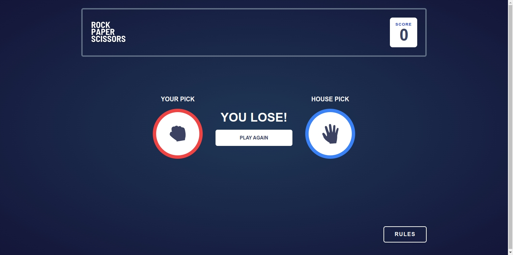

# ROCK, PAPER, SCISSORS GAME APP

This is a solution to the [Rock, Paper, Scissors challenge on Frontend Mentor](https://www.frontendmentor.io/challenges/rock-paper-scissors-game-pTgwgvgH).

## Table of contents

- [ROCK, PAPER, SCISSORS GAME APP](#rock-paper-scissors-game-app)
  - [Table of contents](#table-of-contents)
  - [Overview](#overview)
    - [The challenge](#the-challenge)
    - [Screenshots](#screenshots)
    - [Mobile 375px](#mobile-375px)
    - [Mobile 430px](#mobile-430px)
    - [Laptop 15"](#laptop-15)
    - [Desktop WideScreen 1521px](#desktop-widescreen-1521px)
    - [Link](#link)
  - [My process](#my-process)
    - [Built with](#built-with)
    - [State](#state)
  - [Author](#author)

## Overview

### The challenge

Users should be able to:

- View the optimal layout for the game depending on their device's screen size
- Play Rock, Paper, Scissors against the computer
- Maintain the state of the score after refreshing the browser

### Screenshots

### Mobile 375px

 \

### Mobile 430px

 \

### Laptop 15"

 \

### Desktop WideScreen 1521px

### Link

- Live Site URL: [Here](https://rock-paper-scissors-game-swart-beta.vercel.app/)

## My process

### Built with

- [React](https://reactjs.org/) - JS library
- [Tailwind](https://tailwindcss.com/)
- Typescript
- Mobile-first workflow

### State

Global state is managed with ContextApi (v1), Redux (v2) and Zustand (v3). The 3 versions are managed in different branches, using the latest version (Zustand) in the main. The idea of ​​managing the states in 3 different ways is to practice how each one is managed

## Author

- Linkedin - [Gonzalo](https://www.linkedin.com/in/ferreyragonzalo/)
